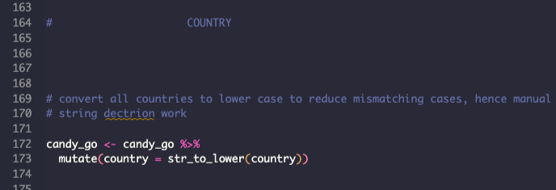
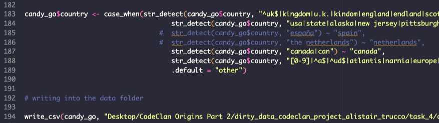

```{r setup, include=FALSE}
knitr::opts_chunk$set(echo = TRUE, fig.align = 'center')
```


# Halloween Candy Data

A project using data comprised of three databases.
Each database is a survey performed yearly between 2015 and 2017.
These surveys are all similar but never identical, both in formatting and the
questions asked so cleaning and tidying is required before the data can be analysed
together.

Cleaning proved to be a long and sometimes laborious task, with certain parts of 
the data, for example the country column, requiring individual changing of many 
entries to make them consistent with the rest of the data.

The script was also hundreds of lines long, now being reduced by some changes in
the order of execution that allowed for less repeated code.

during the analysis stage, a great deal of time was spent on a fairly long function
where solving the problems in a longer format would've actually saved a lot of time.
The thinking was that any other questions with one or more filters could be answered
using the same function.


# Cleaning Candy


It's like when you leave it in your pockets then put them through the wash.

Losing columns that are not candy or data by which we want to sort the ratings.
Making columns match to join later

```{r, echo=FALSE, fig.cap=" ", out.width = '60%'}
knitr::include_graphics("../screenshots/initial_column_tidying.png")
knitr::include_graphics("../screenshots/initial_column_tidying_2.png")
```

add year column to each table 

pivoting long on all rated columns to analyse by rating later.
adding columns to 2015 to make it compatible with other tables.

```{r, echo=FALSE, fig.cap=" ", out.width = '60%'}
knitr::include_graphics("../screenshots/pivot.png")
```

make age into integer for numeric analysis
remove impossible ages and text entries, not worth runnig complex textual analysis
or going through text entries by hand.


```{r, echo=FALSE, fig.cap=" ", out.width = '60%'}
knitr::include_graphics("../screenshots/age.png")
```


homogenise all countries entries for the same countries by first setting all 
to lower case then applying regex filters for synonyms


```{r, echo=FALSE, fig.cap=" ", out.width = '60%'}


```


# Analysis

now that the data is clean we can look into 


```{r, echo=FALSE}
library(tidyverse)
```

```{r, echo=FALSE}
candy <- read_csv("../data/candy_clean.csv")
```

# number of ratings over all years

```{r}
a <- candy %>% 
  filter(!is.na(rating), year == 2015) %>% 
  nrow()
# we removed NA entries in the rating column at the cleaning stage, so this
# has the same number of rows as candy

b <- candy %>% 
  filter(!is.na(rating), year == 2016) %>% 
  nrow()

c <- candy %>% 
  filter(!is.na(rating), year == 2017) %>% 
  nrow()

paste("2015: ", a, "  2016: ", b, " 2017; ", c)
paste(round(a/(a+b+c), 2)," : ",round(b/(a+b+c), 2)," : ",round(c/(a+b+c), 2))

# feeling goofy had to lay it out by hand 
```


# Finding mean age of those going out trick or treating

```{r}
candy %>% 
  filter(going_out == TRUE) %>% 
  summarise(mean(age, na.rm = TRUE))

# removing NAs so as not to receive NA as the mean >:(
```


# Finding mean age of those not going out trick or treating

```{r}
candy %>% 
  filter(going_out == FALSE) %>% 
  summarise(mean(age, na.rm = TRUE))
```


# most loved, despised and uncared for a.k.a
    
the good, the bad and the meh

```{r}
joy <- candy %>% 
  filter(rating == "JOY") %>% 
  count(candy, sort = TRUE) %>% 
  rename("joy_count" = "n")

despair <- candy %>% 
  filter(rating == "DESPAIR") %>% 
  count(candy, sort = TRUE) %>% 
  rename("despair_count" = "n")

meh <- candy %>% 
  filter(rating == "MEH") %>% 
  count(candy, sort = TRUE) %>% 
    rename("meh_count" = "n")

# slice max with n = 2 for joy due to controversial 'any full sized snack bar'
slice_max(joy, joy_count, n = 2)
slice_max(despair, despair_count, n = 1)
slice_max(meh, meh_count, n = 1)
```

# counting fools (starburst despairers)

```{r}
candy %>% 
  filter(rating == "DESPAIR") %>% 
  filter(candy == "starburst") %>% 
  count(candy, sort = TRUE) %>% 
  rename("starburst_haters" = "n")
```


# Net feelies by gender 

writing a function for net feelies (joy - despair) with filters

```{r}
net_feelies <- function(.data = candy,
                        .year = candy$year,
                        .gender = candy$gender,
                        .country = candy$country
                        ){
  
  # create counts for both joy and despair with the filter stated in function
  # then joins tables to output one table with candy arranged by (joy - despair)
  
  j <- .data %>% 
         filter(rating == "JOY",
                year == .year,
                gender == .gender,
                country == .country
                ) %>% 
  count(candy, sort = TRUE) %>% 
  rename("joy_count" = "n")
  
    
  d <- .data %>% 
         filter(rating == "DESPAIR",
         gender == .gender,
         year == .year,
         country == .country,
         ) %>% 
  count(candy, sort = TRUE) %>% 
  rename("despair_count" = "n")
     
  
  # this join does mean that entries that do not have a minimum both 1
  # joy and despair will disappear but these are not too valuable to 
  # know with this functions use
  
  full_join(j,d, by = "candy") %>% 
  mutate(net_feelies = joy_count - despair_count) %>% 
  arrange(-net_feelies)
}
```


slices can be commented out for full rankings

```{r}
slice_max(
  net_feelies(.gender = "Male")
  , net_feelies, n = 2)


slice_max(
  net_feelies(.gender = "Female")
  , net_feelies, n = 2)
```

the two genders are money and Reece's peanut buttercups


# Return of the feelies
    
new feelies function to fix bugs from the first

```{r}

# this much longer conditional function had to be introduced due to the NAs in 2015 
# country and gender returning empty tables (NA == NA returns NA, not TRUE)


net_feelies_debug <- function(.data = candy,
                        .year = candy$year,
                        .gender = candy$gender,
                            .country = candy$country
                        ){
  # checking if .year is a vector of length > 1 i.e. the default instead of a specific year
  # this runs the original script
  
  
  if(length(.year)>1){
    
    net_feelies(.data = .data,
                .year = .year,
                .gender = .gender,
                .country = .country )
    
  }else{
    
    # unfortunately this could not be in an or statement in the first if, r 
    # will try to compare every value in the vector with 2015 returning an error
    
      if(.year != 2015){
            
    net_feelies(.data = .data,
                .year = .year,
                .gender = .gender,
                .country = .country )

      
      }else{
        
      
      j <- .data %>% 
             filter(rating == "JOY",
                    year == .year
                    ) %>% 
      count(candy, sort = TRUE) %>% 
      rename("joy_count" = "n")
      
        
      d <- .data %>% 
             filter(rating == "DESPAIR",
             year == .year
             ) %>% 
      count(candy, sort = TRUE) %>% 
      rename("despair_count" = "n")
         
      full_join(j,d, by = "candy") %>% 
      mutate(net_feelies = joy_count - despair_count) %>% 
      arrange(-net_feelies)
    }
  }
}
```


# Top candies by year

```{r}

slice_max(
net_feelies_debug(.year = 2015)
, net_feelies, n = 3)


slice_max(
net_feelies_debug(.year = 2016)
, net_feelies, n = 3)


slice_max(
net_feelies_debug(.year = 2017)
, net_feelies, n = 3)
```


# Top candies by country 

```{r}
net_feelies_debug(.country = "usa")
net_feelies_debug(.country = "canada")
net_feelies_debug(.country = "uk")
net_feelies_debug(.country = "other")
```
